<p align="center">
  <a href="https://haniumer.com"></a>
  <a href="https://mailhide.io/e/w2H5EHRa"></a>
  
</p>

<p align="center">
  <a href="https://tinyurl.com/ecxpkcdc"></a>
</p>

```console
$ whoami
hani · sydney
$ cat ~/.focus
edge-native apps on cloudflare · self-hosted infra · security research done properly
```

<ul align="center">
  <a><b>Operating Principle</b>: Ship fast. Learn faster. Own the stack.</a>
</ul>

---

### ⚡ What I'm Focused On

- **Cloudflare-native apps.** Whole apps on one Worker: D1, R2, KV, Durable Objects, Queues.
- **Self-hosted infrastructure.** Forgejo with HA failover, Docker, Ansible, Cloudflare Tunnel.
- **Ethical security research.** Teaching labs and documented analysis, authorized testing only.
- **Open-source tools** that solve real workflow pain: webhook inboxes, bots, MCP servers.

> 🔐 Security projects here are strictly for **educational and authorized testing only**.  
No malware, no unauthorized deployment.

---

### 🛠️ Things I've Built

<table>
<tr>
<td valign="top" width="33%">

#### `// edge`
- [**Uptellis**](https://github.com/bts-io/uptellis) status page + monitor, Workers or Docker
- [**0bin-cloudflare**](https://github.com/h1n054ur/0bin-cloudflare) encrypted pastebin on one Worker
- [**elm-chat**](https://github.com/h1n054ur/elm-chat) E2EE rooms on Durable Objects
- [**hookforms-cloud**](https://github.com/h1n054ur/hookforms-cloud) webhook inbox, multi-channel alerts
- [**PingFlare**](https://github.com/h1n054ur/PingFlare) Statuspage alternative
- [**vinext-starter**](https://github.com/h1n054ur/vinext-starter) Next.js API on Vite, on Workers

</td>
<td valign="top" width="33%">

#### `// infra`
- [**vps-git**](https://github.com/h1n054ur/vps-git) Forgejo HA, streaming replication, failover, Ansible
- [**hookforms**](https://github.com/h1n054ur/hookforms) self-hosted webhook inbox
- [**docker-browser**](https://github.com/h1n054ur/docker-browser) remote browser via neko + cloudflared
- [**h1n054ur-terminal**](https://github.com/h1n054ur/h1n054ur-terminal) welcome banner + starship prompt
- [**telegram-cloudflare-relay**](https://github.com/h1n054ur/telegram-cloudflare-relay) Telegram to anywhere

</td>
<td valign="top" width="33%">

#### `// security + ai`
- [**botnet-research-archive**](https://github.com/h1n054ur/botnet-research-archive) historical botnets mapped to MITRE ATT&CK
- [**ghost-lab**](https://github.com/h1n054ur/ghost-lab) browser-native C2 research lab
- [**keystroke-monitor**](https://github.com/h1n054ur/keystroke-monitor) authorized-testing lab on Workers
- [**playwright-mcp-cloudflare**](https://github.com/h1n054ur/playwright-mcp-cloudflare) browser MCP on Workers
- [**chat-first-ui-builder**](https://github.com/h1n054ur/chat-first-ui-builder) UI by conversation, Hono JSX + Claude

</td>
</tr>
</table>

---

### 📡 Live

<table>
<tr>
<td valign="top" width="50%">

#### `// latest releases`
<!--LIVE:RELEASES:START-->
- [**uptellis**](https://github.com/bts-io/uptellis) [`v0.8.4`](https://github.com/bts-io/uptellis/releases/tag/v0.8.4) <sub>5 days ago</sub>
- [**0bin-cloudflare**](https://github.com/h1n054ur/0bin-cloudflare) [`v0.2.0`](https://github.com/h1n054ur/0bin-cloudflare/releases/tag/v0.2.0) <sub>6 days ago</sub>
- [**vps-git**](https://github.com/h1n054ur/vps-git) [`v2.0.0`](https://github.com/h1n054ur/vps-git/releases/tag/v2.0.0) <sub>12 days ago</sub>
<!--LIVE:RELEASES:END-->

</td>
<td valign="top" width="50%">

#### `// recently pushed`
<!--LIVE:PUSHED:START-->
- [**h1n054ur-setup**](https://github.com/h1n054ur/h1n054ur-setup) <sub>today</sub>
- [**desktop**](https://github.com/h1n054ur/desktop) <sub>today</sub>
- [**hyprland-h1n054ur**](https://github.com/h1n054ur/hyprland-h1n054ur) <sub>yesterday</sub>
- [**noctalia-h1n054ur**](https://github.com/h1n054ur/noctalia-h1n054ur) <sub>yesterday</sub>
- [**quickshell-h1n054ur**](https://github.com/h1n054ur/quickshell-h1n054ur) <sub>yesterday</sub>
<!--LIVE:PUSHED:END-->

</td>
</tr>
</table>

<p align="center">
<!--LIVE:STATS:START-->
<sub>Last 12 months: <b>643</b> contributions · <b>557</b> commits · <b>27</b> PRs · <b>22</b> issues · <b>52</b> public repos. Refreshed 2026-10-09.</sub>
<!--LIVE:STATS:END-->
</p>

<p align="center">
  
  
</p>

<p align="center">
  
</p>

<p align="center">
  <picture>
    <source media="(prefers-color-scheme: light)" srcset="./profile/snake-light.svg"/>
    
  </picture>
</p>

---

### 🧰 Stack

<table>
<tr>
<td width="18%"><code>// languages</code></td>
<td></td>
</tr>
<tr>
<td><code>// edge apps</code></td>
<td>
  <br/>
  
  
  
  
  
</td>
</tr>
<tr>
<td><code>// infra</code></td>
<td>
  <br/>
  
  
</td>
</tr>
</table>

---

<p align="center">
  
  
  
</p>

<p align="center">
  <a href="https://git.io/typing-svg">
    
  </a>
</p>

<p align="center">
  
</p>
